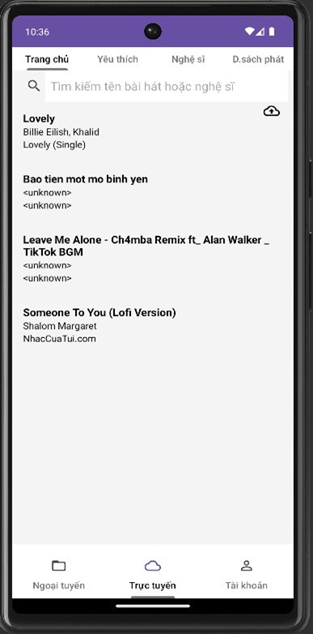

# Music Player App

A mobile music player application developed for Android devices.  
This app allows users to search, listen to, manage, and share music conveniently from their smartphones.

---

## Features

- Search for songs, artists, albums, or genres by keywords
- Play music online with high-quality streaming
- Manage personal playlists (create, edit, delete)
- View song lyrics
- View album details
- Download music for offline listening
- Mark favorite songs
- Shuffle and repeat songs
- Set a sleep timer to automatically stop music
- Karaoke mode with lyrics display
- Switch between songs easily
- User authentication: register, login, reset password
- Share songs via social platforms
- Manage user account (profile, password)
- View downloaded songs and manage offline library

---

## Tech Stack

- **Platform**: Android
- **Programming Language**: Java
- **Database**:   
    - **Firebase Firestore** (for music metadata and song management)
    - **Firebase Storage** (for storing music files)
- **Development Tools**:
  - Android Studio
  - Firebase Console
- **Other Technologies**:
  - MediaPlayer API (for music playback)
  - Firebase Authentication (for user login and account management)

---

## App Screenshots

| Home Screen | Playing Screen | Lyric |
|:-----------:|:--------------:|:-----:|
|  |  |  |

| Album Screen | Account Login | Account Management |
|:-----------:|:--------------:|:-----:|
|  |  |  |

---

## Installation Guide

### 1. Requirements
- Android Studio Bumblebee or newer
- A real Android device or emulator

### 2. How to Setup

```bash
git clone https://github.com/yourusername/music-app.git
cd music-app
```

- Open the project with Android Studio
- Sync Gradle dependencies
- Connect to Firebase
- Build and Run on an emulator or physical device

---

## System Overview

- The app includes:
- Server-side:
    - Music database (songs, albums, artists, genres)
    - User database (accounts, playlists, favorites)
- Client-side (Android app):
    - User Interface (UI) for interacting with the music library
    - Music player module
    - Search functionality
    - Playlist management
    - Download and offline playback module